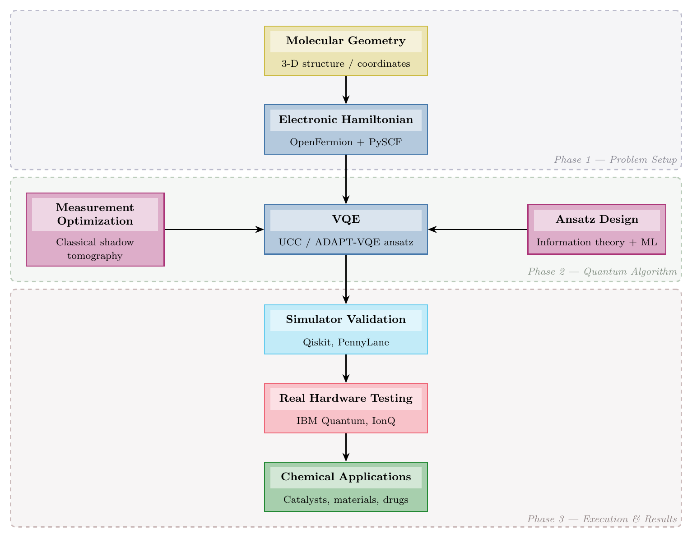

# workflow-diagram

Generates TikZ flowchart/workflow/scheme diagrams for LaTeX scientific and technical documents. Invoked as `/workflow-diagram` in Claude Code.

## What it does

- Reads a workflow description (from context, natural language, or a structured `.md` file)
- Generates a complete `\begin{figure}...\end{figure}` TikZ block
- Uses the **Paul Tol bright** palette (colorblind-safe) by default
- Always prints a **populated block format** after the diagram so you can edit and re-feed it
- Supports science style (rounded rectangles) and coding style (ISO shapes: diamonds, parallelograms)

## Usage

```
/workflow-diagram [flags] [description]
/workflow-diagram --file <path>
```

| Flag | Default | Effect |
|------|---------|--------|
| `--save <path>` | off | Write `.tex` output to file |
| `--file <path>` | — | Read workflow from `.md` block-format file |
| `--horizontal` | off | Left→right layout instead of top→bottom |
| `--scheme tol-bright\|monochrome` | `tol-bright` | Color scheme |
| `--style science\|coding` | `science` | Shape style |
| `--template [path]` | — | Print/save empty skeleton `.md` to fill in |
| `--template-only` | off | Print populated block format, no TikZ |
| `--from-image <path>` | — | Parse diagram from image or PDF file |
| `--sketch` | off | With `--from-image`: extract structure only, output skeleton block format |

## Input modes

**Natural language** — describe inline:
```
/workflow-diagram Input is raw spectra, then baseline correction, then peak fitting, output is integrated intensities. A reference library feeds in from the right.
```

**Block format file** — structured input for complex workflows:
```
/workflow-diagram --file my-pipeline.md
```

Block format syntax:
```
---
[label] Node Title [type]
subtitle / tools
---
|                          ← arrow to next node
---
[next] Next Step [process]
description
---
|>right [side1]            ← side branch right of next node
|
---
[out] Output [output]
result
---

---
[side1] External Tool [side]
description
---

@group [label][next] Phase 1   ← bounding box around those nodes, label at bottom-right
```

Node types: `input`, `process`, `intermediate`, `hardware`, `output`, `side`, `decision`

**Branching / parallel flows:**
```
[A] Fork [process]
[A]|                       ← explicit source fork
[B] Branch 1 [process]
[A]|
[C] Branch 2 [process]
[B][C]|                    ← merge from two sources
[D] Join [output]
```

**Image / PDF input** — recreate an existing diagram from a screenshot, PDF page, or photo:
```
/workflow-diagram --from-image my-diagram.png
/workflow-diagram --from-image paper-figure.pdf
```
Claude reads the image, extracts node titles, types, subtitles, and connections, then generates TikZ + block format. Ambiguous text or arrows are flagged with a note.

**Sketch input** — digitise a hand-drawn layout into an editable template:
```
/workflow-diagram --from-image sketch.jpg --sketch
```
Extracts topology only (boxes + flow, no content). Outputs a skeleton block format with placeholder titles for you to fill in, then re-feed with `--file`.

## Required packages

Add to your LaTeX preamble:
```latex
\usepackage{tikz}
\usetikzlibrary{shapes.geometric, arrows.meta, positioning}
% For group boxes (optional):
% \usetikzlibrary{fit, backgrounds}
\usepackage{xcolor}
\definecolor{wfinput}{HTML}{CCBB44}
\definecolor{wfprocess}{HTML}{4477AA}
\definecolor{wfintermediate}{HTML}{66CCEE}
\definecolor{wfhardware}{HTML}{EE6677}
\definecolor{wfoutput}{HTML}{228833}
\definecolor{wfside}{HTML}{AA3377}
% \definecolor{wfgroup}{HTML}{BBBBCC}  % group box color (optional)
```

## Example

Source: [`examples/qchem-vqe-pipeline.md`](examples/qchem-vqe-pipeline.md)

```
/workflow-diagram --file examples/qchem-vqe-pipeline.md --save examples/qchem-vqe-pipeline.tex
```


